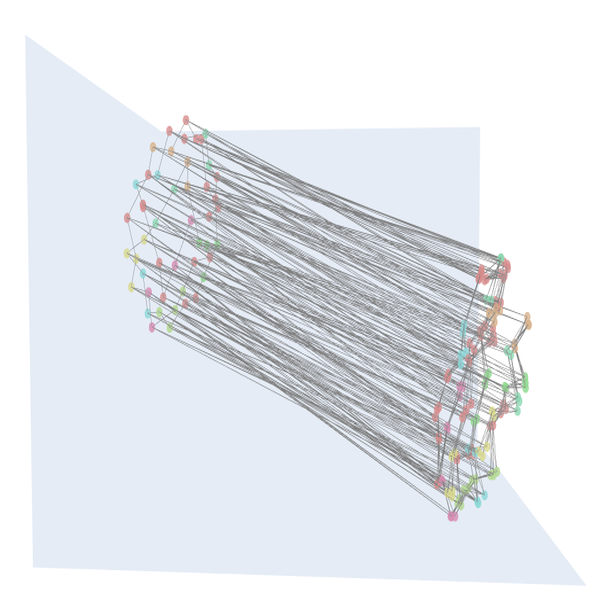
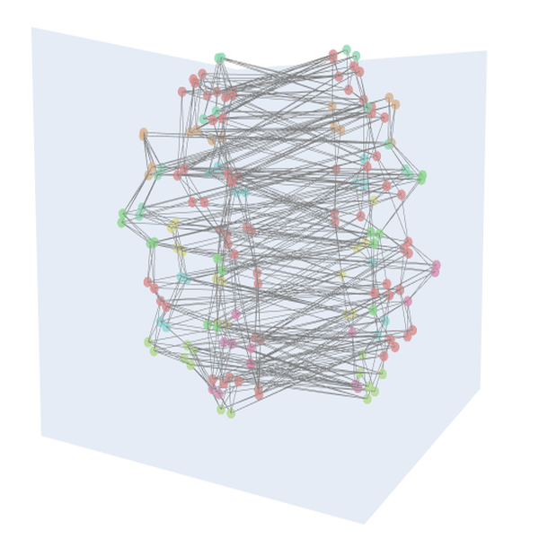
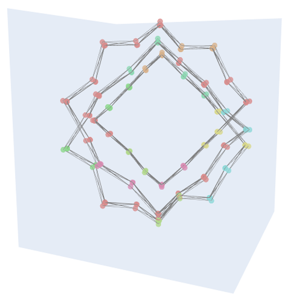

## I Need To Grow Away From These Roots
Ambient music generation inspired by the audio component of David Whiting's artistic piece, [I Need To
Grow Away From These Roots](https://www.vitling.xyz/i-need-to-grow-away-from-these-roots/). 
All credit to the original artist. 

The principal script of this repository (`main.py`) will produce a network of chords and a ruleset by which to 
traverse those chords, then play that soundscape using Python's `simpleaudio` package.

The second component of this repository (`trinity_visualization/trinity.py`) transforms the chord network into a 
readable format for the [Trinity 3D visualization tool](https://github.com/trinity-xai/Trinity). The chord network is also rendered as a 
3D network in `plotly` to serve as a preview.

## Usage
This module runs on Python 3.12. When run, the program will continue generating an ambient soundscape indefinitely. 
```bash
uv sync
uv run main.py
```

If you do not already have `uv` installed, you can install it via
```bash
curl -LsSf https://astral.sh/uv/install.sh | sh
```

## Visualization
You can render a 3D network visualization of the chords by running,
```bash
uv run -m trinity_visualization.trinity
```
Under the default configuration, this will generate a `trinity_graph.json` file compatible wth data ingest by 
the Trinity tool. The script will also render a simpler visualization of the chord network in a browser using
`plotly`; I've been using this simpler visualization to experiment with settings like separation coefficients/ 
distance metrics when plotting various chord configurations, octaves, etc. 

Some examples are shown below,

_Chords spanning two octaves, with greater separation induced between them._


_Reducing the octave separation, increasing separation by notes._


_Further reducing octave separation, such that chords group by shared notes strongly._

